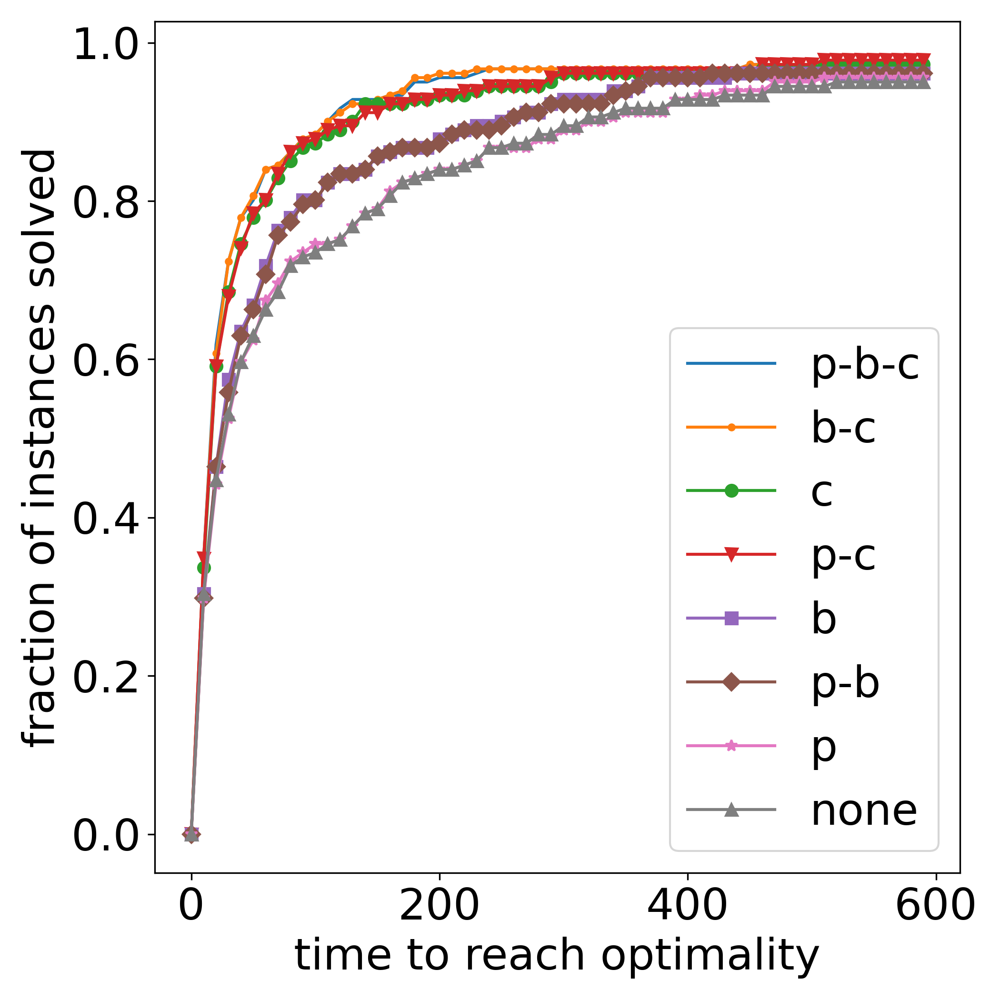
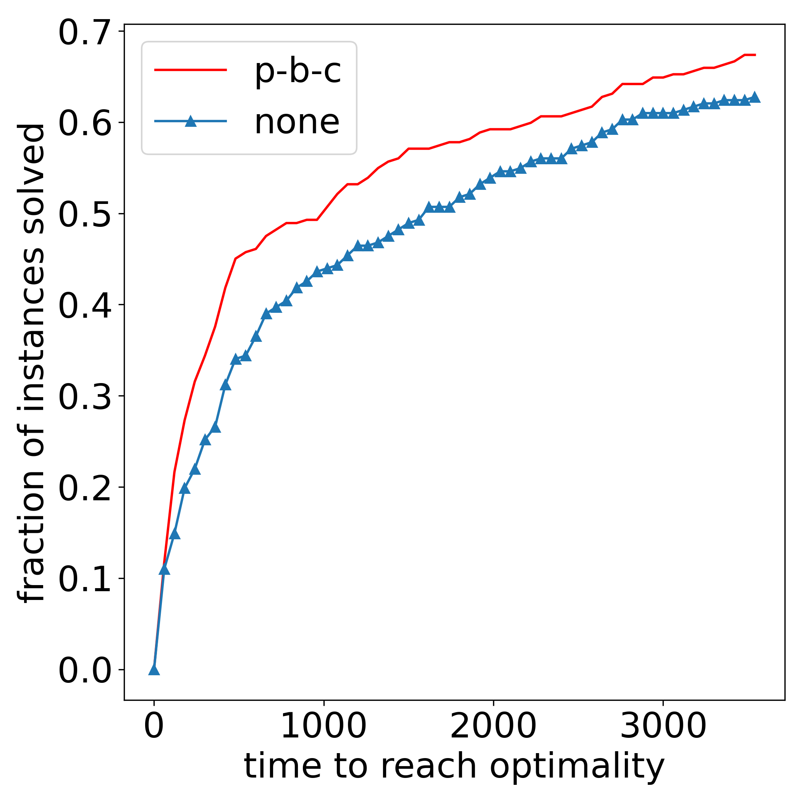
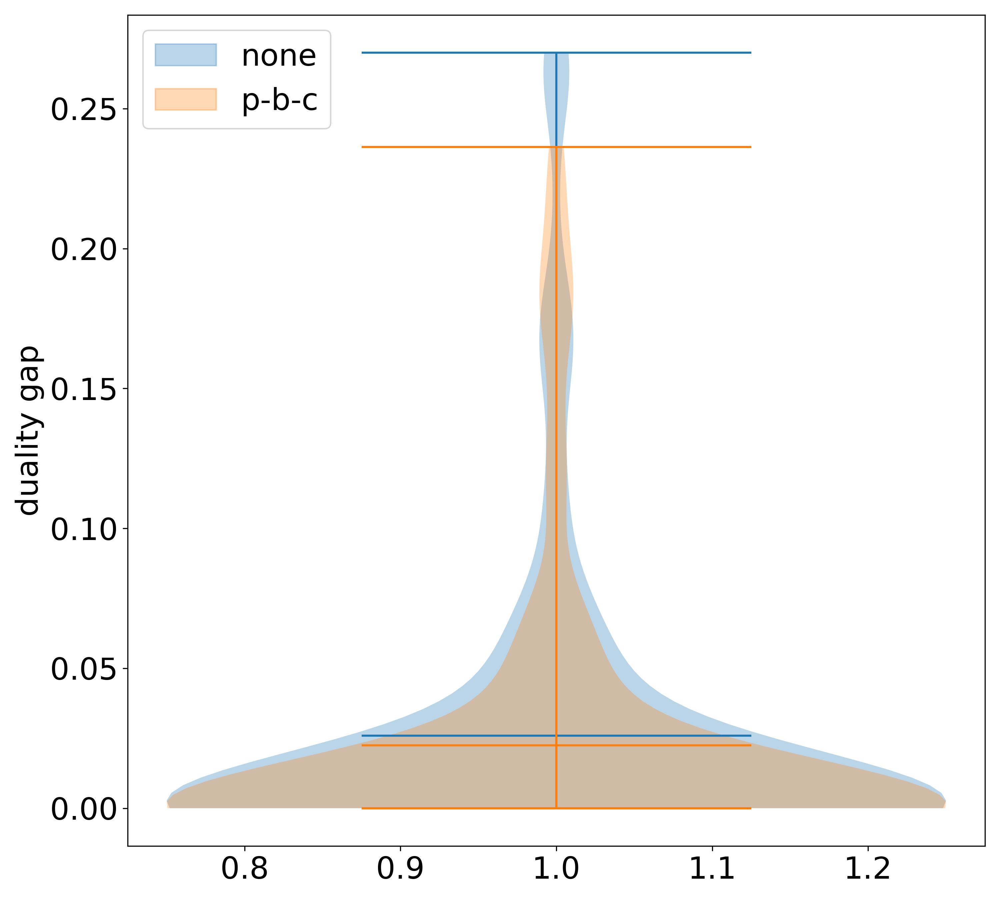
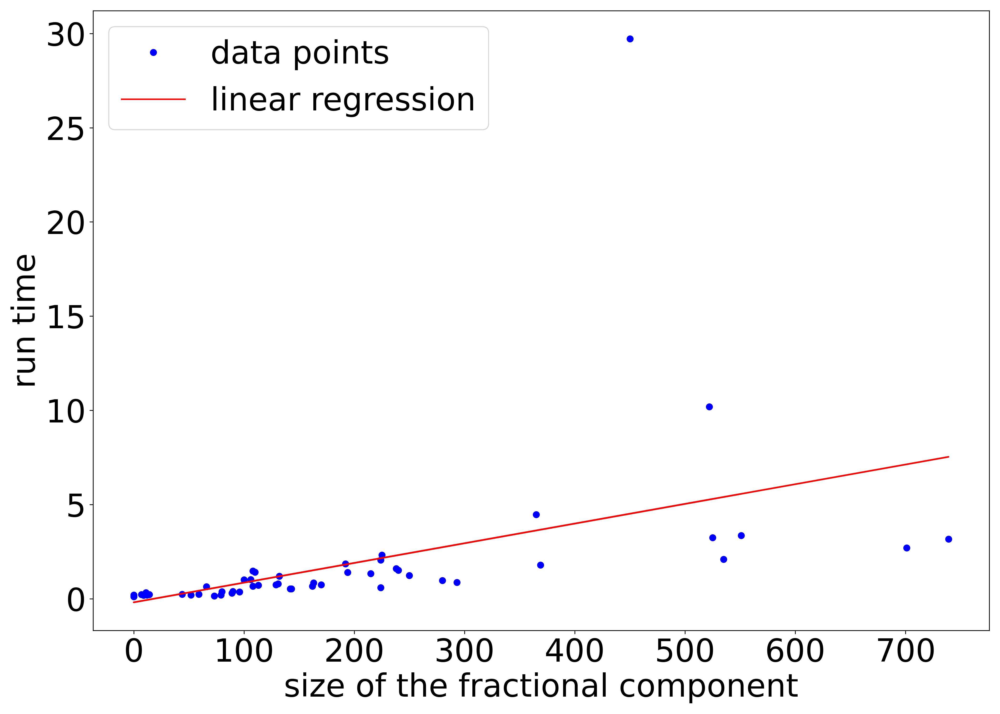
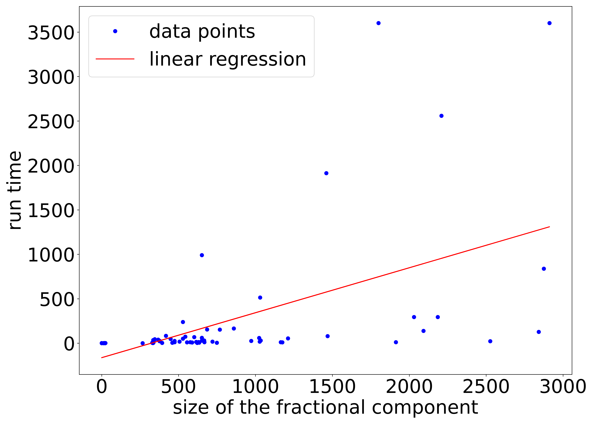
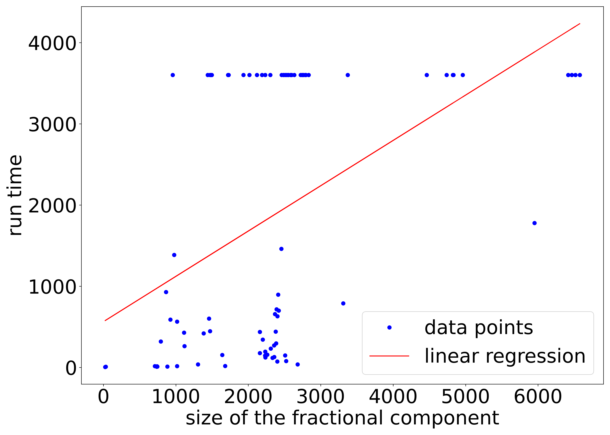

[](https://pubsonline.informs.org/journal/ijoc)

# On Discrete Subproblems in Integer Optimal Control with Total Variation Regularization in Two Dimensions

This archive is distributed in association with the [INFORMS Journal on Computing](https://pubsonline.informs.org/journal/ijoc) under the [MIT License](LICENSE).

The software and data in this repository are a snapshot of the software and data that were used in the research reported on in the paper [On Discrete Subproblems in Integer Optimal Control with Total Variation Regularization in Two Dimensions](https://doi.org/10.1287/ijoc.2024.0680) by P. Manns and M. Severitt.

## Cite

To cite the contents of this repository, please cite both the paper and this repo, using their respective DOIs.

https://doi.org/10.1287/ijoc.2024.0680

https://doi.org/10.1287/ijoc.2024.0680.cd

Below is the BibTex for citing this snapshot of the repository.

```
@article{manns2024on,
  author =        {P. Manns and M. Severitt},
  publisher =     {INFORMS Journal on Computing},
  title =         {On Discrete Subproblems in Integer Optimal Control with Total Variation Regularization in Two Dimensions},
  year =          {2024},
  doi =           {10.1287/ijoc.2024.0680.cd},
  url =           {https://github.com/INFORMSJoC/2024.0680},
  note =          {Available for download at https://github.com/INFORMSJoC/2024.0680},
}  
```

## Description

The goal of this repository to be able to trace and reproduce the results and plots in the referenced article. For the results in this article, we used the general purpose integer programming solver Gurobi version 10.0.0. In addition, you need to have the python packages pandas, numpy, scipy, and pybind11 installed to be able to build the code for computing the weights of the cutting planes from 5.1.1.

## Results

We briefly describe the figures in the article that visualize our results. Figure 5 contains two performance plots for $N = 64$ and $N = 96$ that visualize the fraction of instances that are solved over the time until 3600s.





Figure 6 contains a violin plot that shows the distribution of the remaining duality gap after the time limit of 3600s.



Figure 7 shows the relation between the size of the fractional component and the run time for $N = 32$ and $\Delta = 64$, $N = 64$ and $\Delta = 256$, $N = 96$ and $\Delta = 576$ in three plots.







The plots were generated from the csv-files in the directory *data*. The rows of the csv-files contain objective values, duality gaps, and run time information of the optimization with Gurobi for a different configurations of employed MIP techniques and instances. These csv-files are named as follows.

```
%N%_%i%.csv
```

where %N% is a placeholder for the number of grid cells $N$ that determines the problem size and %i% encodes the values for alpha, where $\alpha(i) = 4 \times \sqrt{5}^i 10^{-4}$. The columns in the csv-files encode the following information. The first column (*Name*) indicates the instance. Columns 2-5 indicate if the optimization is carried out with (value 1) or without (value 0) the primal heuristic from section 5.2 (column *P*), the branching rule from section 5.3 (columns *B*), the cutting planes from section 5.1.1 (column *C1*), and the cutting planes from section 5.1.2 (column *C2*). Note that in our experiments, we have always used either no or both types of cutting planes. The 6th column (*Objective without constant*) contains the optimal objective value of the optimization problem returned by Gurobi by means of the *GetObjective* method. The 7th column (*Objective*) contains this value minus a constant term corresponding to $\alpha TV(v)$ (see section 2) which is thus the objective value of the trust-region subproblem (the negative of the predicted reduction). The 8th column (*Gap*) contains the *MIPGap* value of the optimization in Gurobi. The 9th column (*LB*) contains the *ObjBound* value from Gurobi, the best achieved lower bound. The last column (*Time*) gives the run time in seconds. Note that the 9th column (*LB*) is only present in the instances for $N = 96$.

These csv-files were generated by executing the optimization on the instances (npz) files in the directory *instances*. They are named

```
ad_grb_%j%.log.npz
```

where $j$ is the index of the instance.

With our computational setup and computer configuration, $23$ instances could not be solved by *p-b-c* but could be solved by *none*, while the opposite case occurred for $37$ instances. For these *hard* instances, we re-computed them with an increased time limit of three hours. We provide lists of these instances in the files

```
hard_instances_for_pbc.csv
```

and

```
hard_instances_for_none.csv
```

that are also located in the directory *instances*.


## Replicating

If you want to replicate the plots, execute the script

```
python figures.py
```

If you want to replicate the production of the data from the instances (for example to test our approach with a newer version of Gurobi in the future), execute the following steps from the directory *src*. Note that this will overwrite the csv-files in the directory *data*. Note that the determination of the *hard* instances is not done in these steps in order to maintain a consistent set of instances because they may differ on different computational setups.

Create python bindings for the C++ code.

```
$ c++ -O3 -Wall -shared -std=c++11 -fPIC $(python3 -m pybind11 --includes) primalimprovewithtop.cpp -o top_improve$(python3-config --extension-suffix)
```

```
$ c++ -O3 -Wall -shared -std=c++11 -fPIC $(python3 -m pybind11 --includes) weights_fullyconnected.cpp -o calc_weights$(python3-config --extension-suffix)
```

Load the instances and run the optimization experiments. Note that the results computed on your computed will likely differ to some extent due because it is very unlikely that Gurobi does the exact same decisions on your computer, in particular because we used parallelization since the computational effort was otherwise unmanageable.

```
python run_experiments.py
```

Execute the computation of the size of the fractional component by solving the root LPs for all instances.

```
python run_fracsize_calc.py
```

Create new plots.

```
python create_figures.py
```

